# WITT

`WITT`는 기발함을 의미하는 단어 "**Wit**" 와 "**What is that**" 의 합성어로, 딥러닝 기술을 활용하여 다양한 사용자들에게 편의를 제공하는 서비스를 구현하자는 취지를 담고 있습니다. WITT의 핵심 기능은 `안드로이드 모바일 카메라`를 통한 `실시간 객체 탐지 및 이미지 탐색`으로서, 사용자가 자율적으로 주변 환경과 객체를 탐색할 수 있도록 서비스를 지원합니다. 더불어, 탐색한 객체에 대한 정보를 제공받을 수 있도록 `GPT`,`번역(한국어, 영어, 일본어, 중국어)`, `OCR(Optical Character Recognition)` 및 `STT(Speech To Text)` 서비스를 지원합니다.  

`WITT` is a compound word of the words "**Wit**", which means ingenious, and "**What is that**", and its purpose is to implement services that provide comfort to a variety of users by utilizing deep learning technology. If not. WITT's core function is to operate an 'Android mobile camera', provide real-time image navigation functions, and support users to autonomously explore their surroundings. Together, we support `GPT`, `Translation (Korean, English, Japanese, Chinese)`, `OCR (Optical Character Recognition)` and `STT (Speech To Text)` services to help you stay informed about what you are exploring. You can. answer.  

## Why you need WITT

* 혁신적 기술과 시각화를 통한 교육적 접근성 향상  
Improving educational accessibility through innovative technology and visualization  

* 사전 학습이 필요없는 환경 및 물체 탐색  
Explore environments and objects without prior learning  

* 개별화된 교육환경으로의 변화  
Change to an individualized educational environment  

## WITT Goal

* 바운딩 박스를 통한 실시간 객체 탐지 서비스 지원  
Supports real-time object detection service through bounding box  

* 사용자 주도적 환경 탐색 및 학습 경험 제공  
Provides user-driven environmental exploration and learning experience  

* 다차원적 도구로서의 활용  
Use as a multidimensional tool  

## Artifact

WITT 프로젝트 아티팩트 폴더는 본 리포지토리에 포함되어 있으며, 주요 디렉토리 구성은 다음과 같습니다.  
상세한 아티팩트 디렉토리 구성 및 실험 결과와 관련한 정보는 [링크](https://github.com/CAVASOL/witt/tree/main/artifact)를 클릭하여 확인해 주세요.

```
artifact
    ├── Yolov5l
    ├── Yolov8n
    ├── animals_Y5l.ipynb
    ├── animals_Y8n.ipynb
    ├── Augmentation.ipynb
    └── README.md
```

## Development environment

* **IDE**: VS Code  
* **Version Control**: Git & Github  
* **Models**: YOLO v5l, YOLO v8n  
* **Technology Stack**: Flutter Framework, Dart, Flutter Packages, Firebase, HTTP  

## WITT Screen Composition and Functions

| **Welcome** |  **Sign-in**  |  **Home** |
| :---:|:---:|:---:|
| 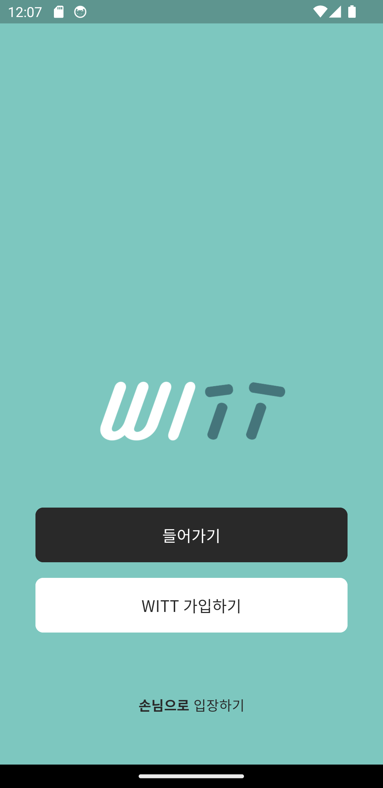 | 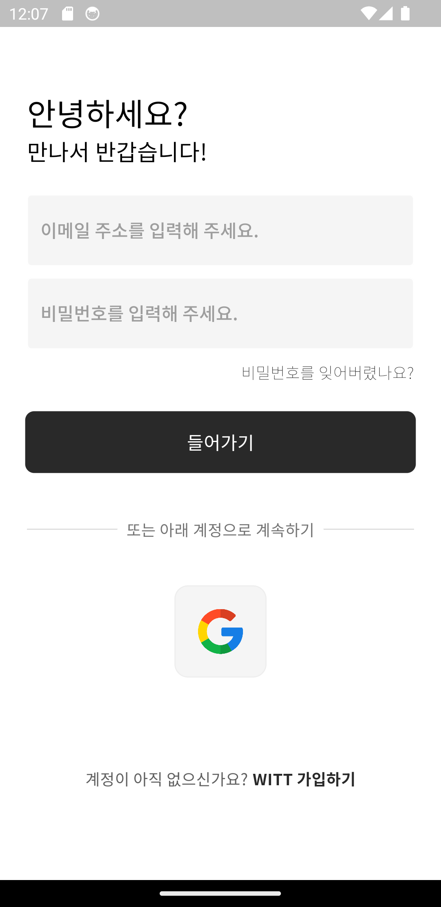 | 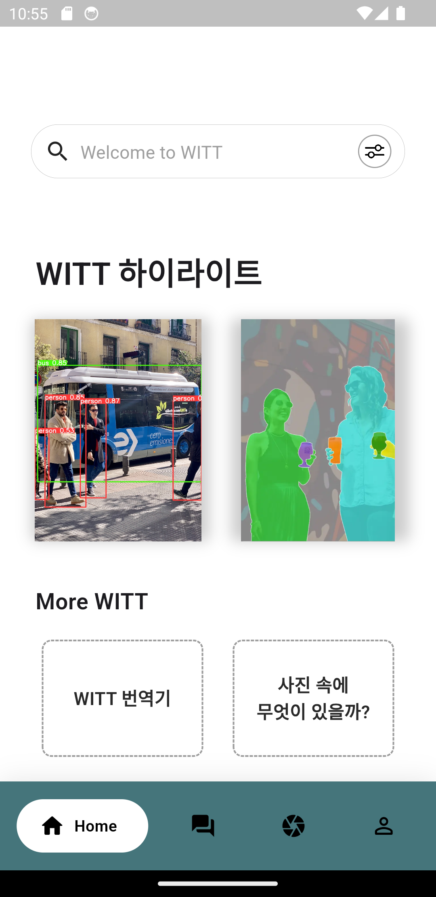 |

| **Home** | **Explore** | **Image Detection** (YOLO v5l)  |
| :---:|:---:|:---:|
|  | 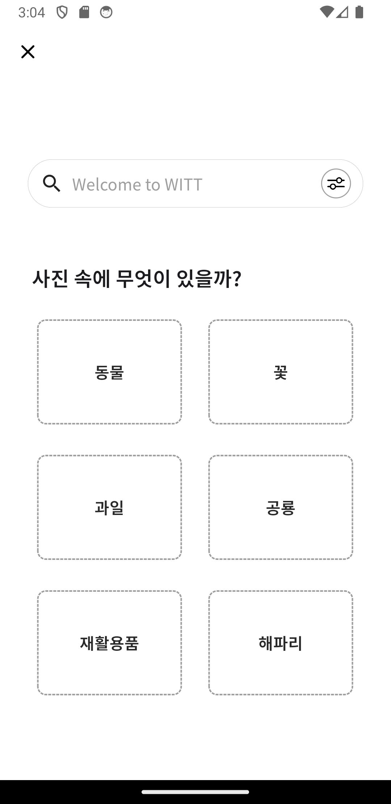 |  |

| **Camera** | **Live Detection** (YOLO v8n) | **Image Detection** (YOLO v8n) |
| :---:|:---:|:---:|
| 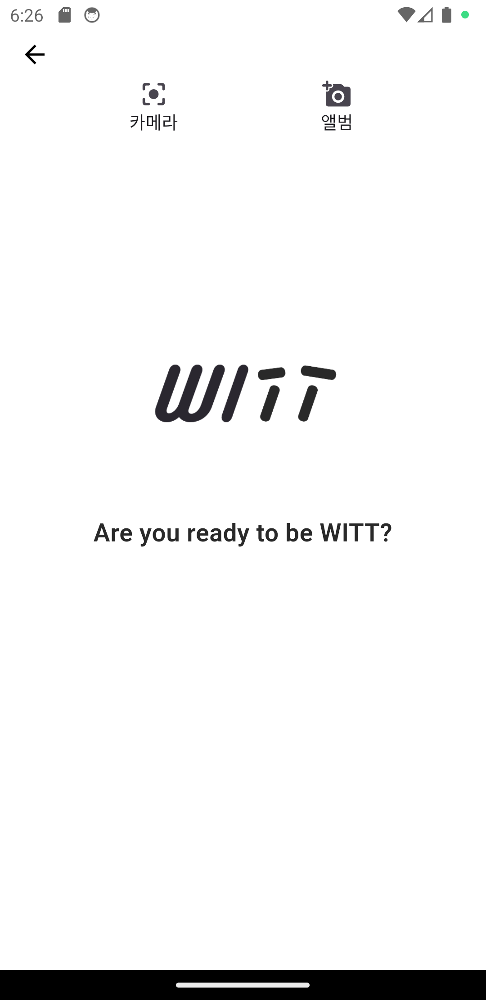 | 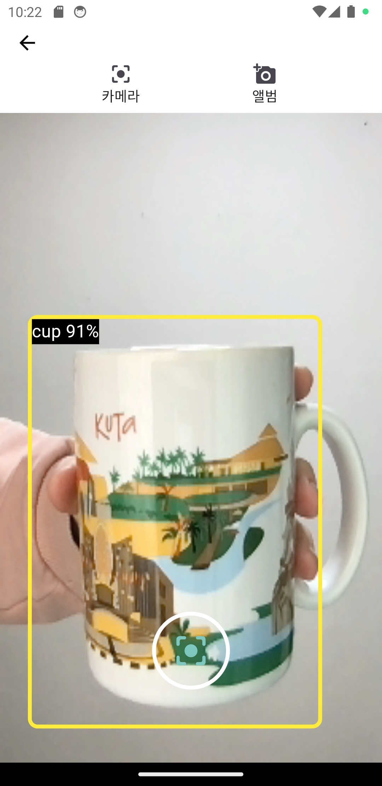 | 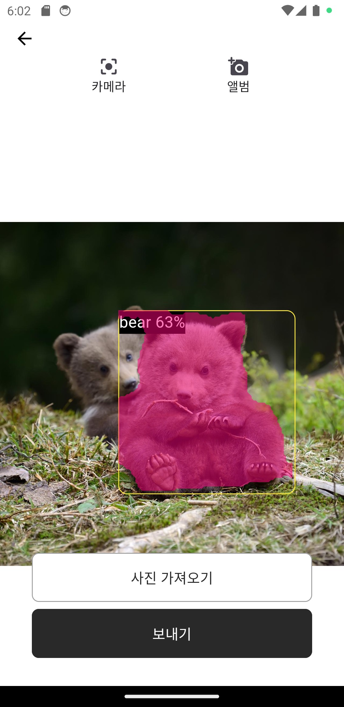 |

| **Chat GPT** | **GPT with Korean** | **GPT with English**  |
| :---:|:---:|:---:|
| 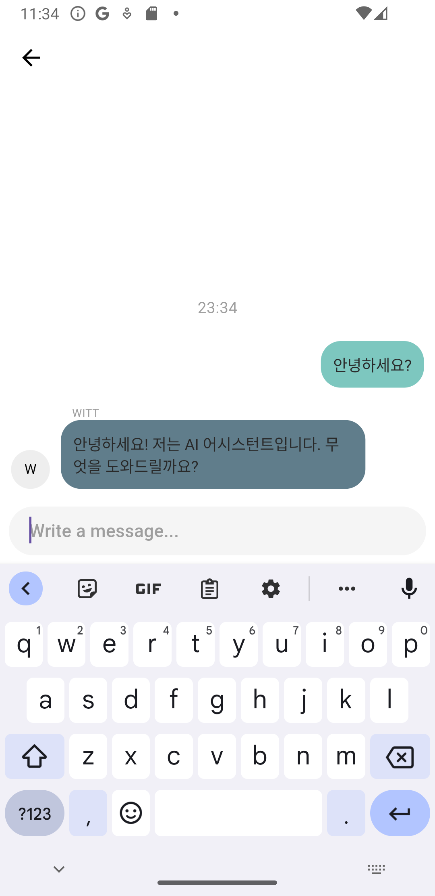 | 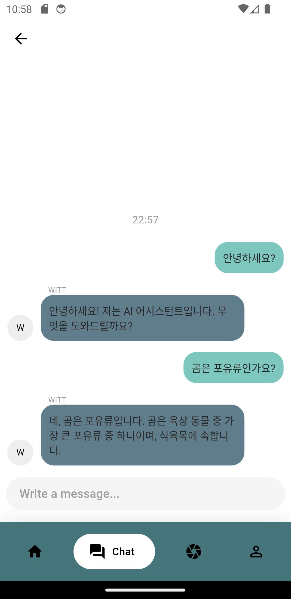 |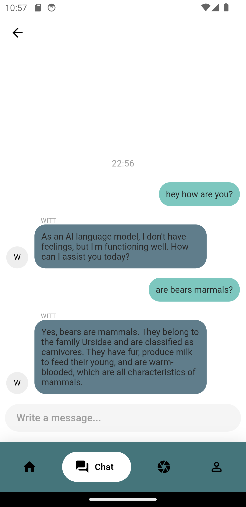 |

| **Translator** | **캡쳐하기** (OCR) | **캡쳐한 후 번역** (OCR) |
| :---:|:---:|:---:|
| 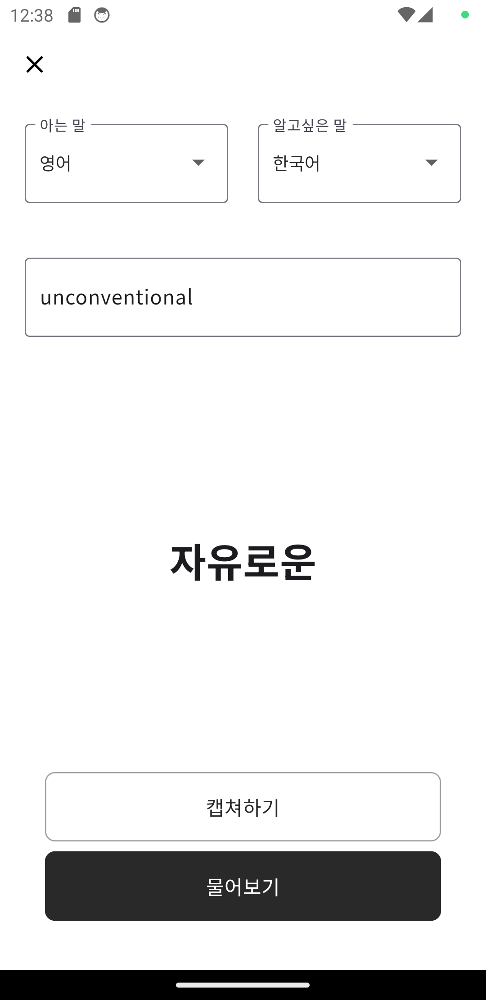 | 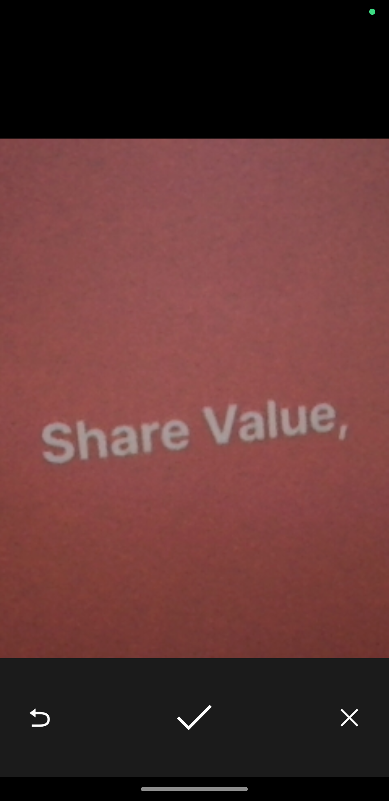 | 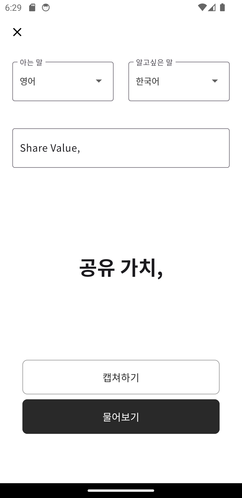 |
